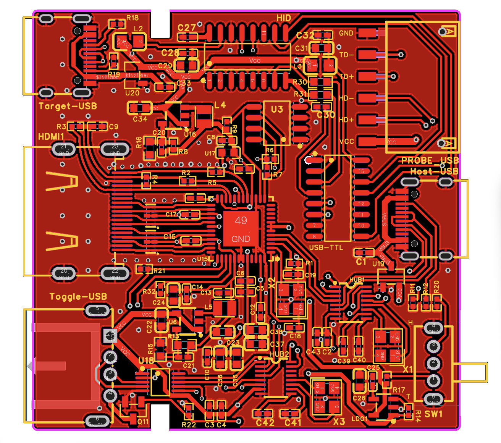
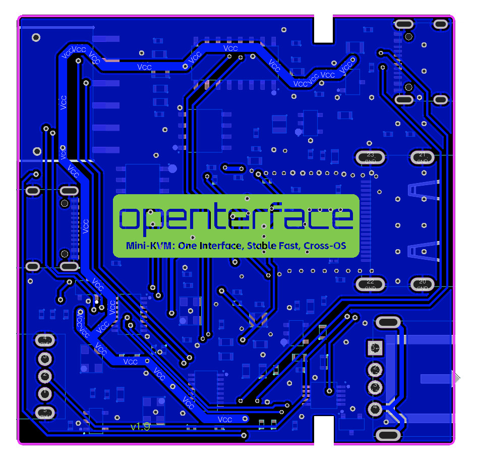

# Welcome to Openterface Mini-KVM Hardware

## Overview

The [Openterface Mini-KVM](https://openterface.com/) is a compact, feature-rich, and open-source KVM gadget driven by a vibrant [community](https://openterface.com/community/). It allows you to use your own laptop to display and control headless devices directly through a USB and HDMI connection. This KVM-over-USB solution captures video via HDMI and simulates keyboard and mouse inputs. It is particularly useful for a wide range of applications, catering to tech enthusiasts exploring single-board computers, as well as IT professionals troubleshooting headless devices. It eliminates the need for additional monitors, keyboards, and mice, providing a convenient solution in environments where network connections are unreliable or unavailable.

## Hardware Features

The Openterface Mini-KVM PCB board comes with a variety of features designed to provide a seamless and efficient user experience:

- **Compact Design**: Small form factor that fits easily into any setup.
- **HDMI Input**: Captures video from headless devices via HDMI.
- **USB Connectivity**: Simulates keyboard and mouse inputs through a single USB connection.
- **Open Source**: Fully open-source hardware and software, allowing for community-driven development and customization.
- **High Compatibility**: Supports a wide range of devices and operating systems.
- **Durable Build**: The frame uses high-quality anodized aluminum, features a clearly marked housing design, and includes a 3D printed side cover that you can easily reprint yourself if broken.
- **Easy Setup**: Simple plug-and-play functionality with minimal configuration required.
- **Community Support**: Backed by a vibrant and active community for troubleshooting and enhancements.
- **Switchable USB Port**: Features a switchable USB-A 2.0 port that can be toggled between the host and target computers, but not both simultaneously. Switching can be done via a physical toggle on the device or a button in the host application.
- **Extension Pins**: Provides USB 5V power supply, data lines, and ground connections for external components, allowing users to easily add functions to both the target and host computers.

## PCB Design

## Software

To use this mini-KVM, the host computer must have one of the following host applications installed: 
- [Openterface_MacOS](https://github.com/TechxArtisanStudio/Openterface_MacOS): For macOS support. The macOS app is also available on Apple's App Store by searching for "Openterface".
- [Openterface_QT](https://github.com/TechxArtisanStudio/Openterface_QT): For Windows and Linux Support.

You can find the installation instructions on the respective GitHub repositories. These open-source host applications are currently under active development. Support for Android and web extensions will be available soon. For more information about the software, please visit the repositories.

## license
- Hardware is released under CERN Open Hardware Licence Version 2 - Strongly Reciprocal
- Its softwares are released under GNU AFFERO GENERAL PUBLIC LICENSE Version 3
- Documentation is released under [CC BY-SA 4.0](https://creativecommons.org/licenses/by-sa/4.0/legalcode)

## Get Involved

[Keen to contribute?](https://openterface.com/contributing/) Fancy joining our team? Drop us an [email](mailto:info@techxartisan.com)!

